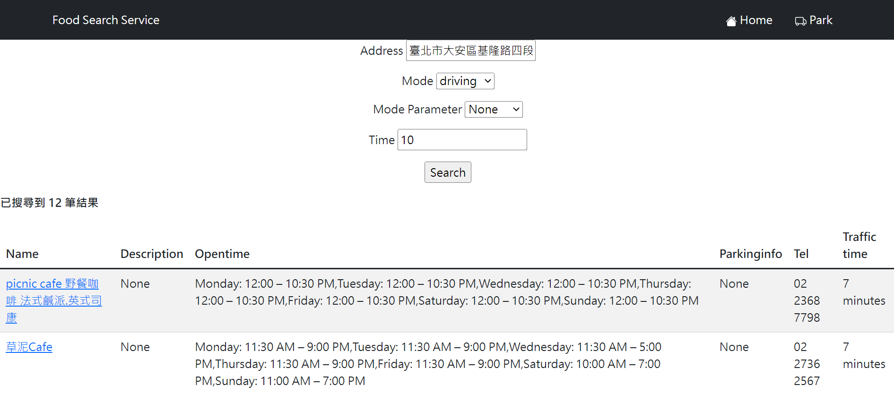
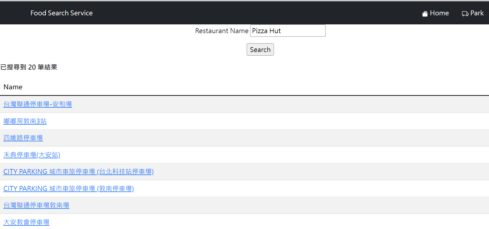

# FoodSearchService-TW

## Brief Introduction
- A simplified google map that considers traffic costs based on current location and provides more appropriate search functions.
- Different from the past that only displayed the distance, it is changed to use a more intuitive traffic time.

## System Component
 - Frontend : HTML, CSS, Bootstrap
 - Backend : Flask, sqlAlchemy
 - Database : google cloud sql (postgreSQL)
 - Service : google map API (Distance Matrix API, Places API)

## Prerequisite
### **1. Prepare Python Environment**

Create a virtual environment : 
    
    python -m venv <environment path>

Download library : 

    pip install -r requirement.txt

### **2. Create google cloud sql instances**

- Read Reference 1, Section : Create and manage---instances.

### **3. Setup google map API**

- Distance Matrix API -> Read [Reference](https://github.com/Manders-Ma/FoodSearchService-TW#reference) 2, Section : setup.

- Places API -> Read [Reference](https://github.com/Manders-Ma/FoodSearchService-TW#reference) 3, Section : setup.

### **4. Create table and import data for database**

You can use goole cloud sql interface to import data.Or use pgAdmin ([reference](https://www.youtube.com/watch?v=SPvA858VnX0&ab_channel=RandomCodingDood))

- Run "./hunter/connectDB.py" to create all the table what you need.

- import "./dataset/location.csv" for location table.
- import "./dataset/restaurant.csv" and "./dataset/TaipeiRest.csv" to restaurant table.

- Run "Preprocessing.py" to preprocess data and get park data(If you don't have park data).

## Reference
1. [Use python to connect cloud sql (postgreSQL)](https://cloud.google.com/sql/docs/postgres/connect-connectors?hl=zh-tw)
2. [Distance API document](https://developers.google.com/maps/documentation/distance-matrix)
3. [Place AP document](https://developers.google.com/maps/documentation/places/web-service)

## ER diagram

## Relational schema diagram

## Example

